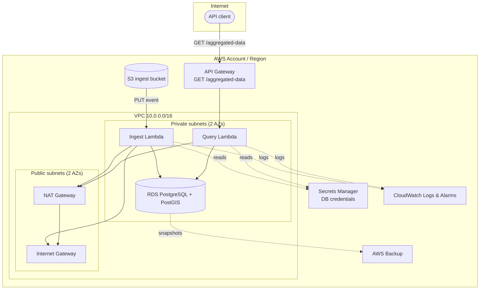

# Architecture

## Overview diagram



## Data flow

1. A CSV file is uploaded (`PUT`) to the S3 ingest bucket.
2. S3 emits an `s3:ObjectCreated:Put` event that invokes the **ingest Lambda**
   (running in a private subnet).
3. The ingest Lambda:
   - Downloads and parses the object.
   - Validates each row against a minimal schema (numeric lat/lon in range,
     non-empty category, numeric value). Invalid rows are logged and
     skipped rather than failing the whole file.
   - Aggregates valid rows by `category`: count, average value, and a
     centroid point (mean lat/lon).
   - Connects to PostgreSQL (via credentials fetched from Secrets Manager,
     over the NAT Gateway path is *not* needed for this — RDS is reached
     directly inside the VPC; NAT is only for internet-bound calls such as
     the Secrets Manager/S3 API endpoints when no VPC endpoints are used)
     and upserts the aggregates into `aggregated_data`, creating the table,
     the `postgis` extension, and a GiST spatial index if they don't exist.
4. A client calls `GET /aggregated-data` (optionally `?category=...&limit=...`)
   on API Gateway, which invokes the **query Lambda** (also in a private
   subnet) to read from PostgreSQL/PostGIS and return JSON.
5. Both Lambdas log to CloudWatch Logs; CloudWatch Alarms watch for Lambda
   errors/throttles and publish to an SNS topic.
6. AWS Backup takes a daily snapshot of the RDS instance (30-day retention),
   and a separate scheduled **backup Lambda** (`lambda/backup/handler.py`)
   exports the `aggregated_data` table to `s3://<bucket>/backups/` daily —
   a plain-CSV, queryable backup of just the aggregated results, distinct
   from the full-instance RDS snapshot.

## Networking

- **VPC** `10.0.0.0/16` spanning 2 Availability Zones.
- **Public subnets**: host the NAT Gateway and Internet Gateway route; no
  compute runs here.
- **Private subnets**: host both Lambda functions (via `vpc_config`) and the
  RDS instance. Lambdas reach the internet (e.g. for AWS API calls not
  reachable via a VPC endpoint) through the NAT Gateway; they reach RDS
  directly over the VPC's local route.
- **Security groups**: the Lambda SG allows all outbound traffic; the RDS SG
  allows inbound TCP/5432 **only** from the Lambda SG. RDS is never publicly
  accessible.

## Why credentials never touch Lambda environment variables

The RDS master password is generated with `random_password` and stored only
in AWS Secrets Manager. Lambda's IAM role is granted `secretsmanager:GetSecretValue`
scoped to that one secret ARN; the function fetches and caches it in memory
per warm container. This avoids ever writing the password into Terraform
plan output, Lambda console environment variables, or CloudWatch Logs.

## Event-driven processing details

- **Delivery semantics**: S3 invokes the ingest Lambda asynchronously
  (`event` invocation type). Async invocations are retried automatically by
  Lambda (up to 2 additional attempts) on failure. This means processing
  must be **idempotent** — the same S3 event can legitimately arrive more
  than once.
- **Idempotency**: `aggregated_data` has a `UNIQUE (category, source_file)`
  constraint, and the insert is an `ON CONFLICT ... DO UPDATE` upsert.
  Re-processing the same file (whether from a Lambda retry or a manual
  re-upload of the same key) replaces that file's aggregate rows instead of
  duplicating them.
- **On-failure destination**: if all of Lambda's automatic retries for a
  given event still fail, the event would normally be dropped. An
  `aws_lambda_function_event_invoke_config` on-failure destination sends it
  to an SQS queue (`<project>-ingest-dlq`, 14-day retention) instead, so
  failed files are recoverable and inspectable rather than silently lost. A
  CloudWatch alarm fires the moment that queue is non-empty.
- **Reserved concurrency**: the ingest function has
  `reserved_concurrent_executions` (default 10) so a burst of simultaneous
  S3 uploads can't open more concurrent connections than the RDS instance's
  `max_connections` can handle. This is a deliberate backpressure
  mechanism — excess invocations queue internally (S3 event invokes are
  async) rather than all firing at once and exhausting the DB.
- **Least-privilege IAM**: the shared Lambda execution role only grants
  `s3:GetObject` scoped to the ingest bucket, `secretsmanager:GetSecretValue`
  scoped to the one DB secret, `sqs:SendMessage` scoped to the one DLQ, and
  the AWS-managed `AWSLambdaVPCAccessExecutionRole` (ENI + log group
  management). No wildcard resource ARNs.
- **Partial-file tolerance**: within a single file, one malformed row never
  aborts the rest — validation happens per-row and bad rows are logged and
  skipped (see "Data schema & validation" in the README).

## Geospatial query optimization

The `/aggregated-data` endpoint isn't just a flat table scan with a
`category` filter — it supports two genuinely spatial query modes, both of
which the query planner can satisfy using the GiST index on `centroid`
instead of scanning every row:

- **Bounding box**: `?bbox=minLon,minLat,maxLon,maxLat` →
  `ST_Intersects(centroid, ST_MakeEnvelope(...))`.
- **Radius search**: `?lat=...&lon=...&radius_km=...` →
  `ST_DWithin(centroid::geography, ST_MakePoint(...)::geography, radius_m)`,
  which accounts for the earth's curvature rather than treating degrees as
  flat units.

Both can be combined with `?category=...`. Example:

```bash
# Everything within 50km of Manhattan
curl "$API/aggregated-data?lat=40.7128&lon=-74.0060&radius_km=50"

# Everything inside a bounding box over the continental US
curl "$API/aggregated-data?bbox=-125,24,-66,49"
```
